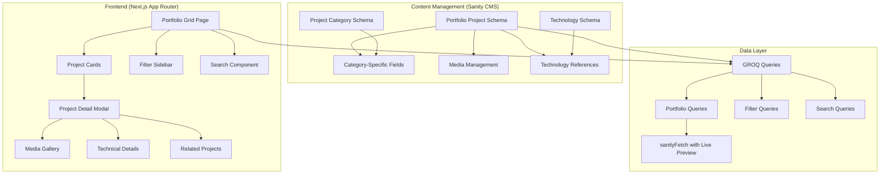
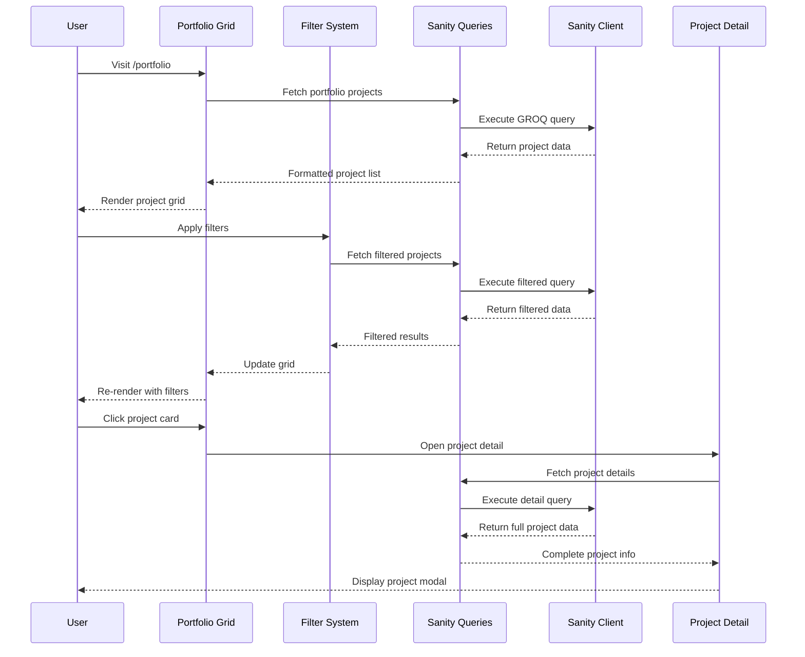

# Portfolio Showcase - Design Document

## Overview

The Portfolio Showcase system will extend the existing Next.js + Sanity CMS architecture to create a sophisticated multi-type project presentation platform. Building on the current blog-focused structure, this design introduces a new `portfolioProject` document type with category-specific schemas, interactive UI components, and advanced filtering capabilities while maintaining the established design language and performance standards.

## Architecture

### System Architecture



### Data Flow Architecture



## Components and Interfaces

### Core Component Structure

#### 1. Portfolio Grid System

**PortfolioGrid Component**
```typescript
interface PortfolioGridProps {
  initialProjects: PortfolioProject[];
  categories: ProjectCategory[];
  technologies: Technology[];
  totalCount: number;
}

const PortfolioGrid: React.FC<PortfolioGridProps> = ({
  initialProjects,
  categories,
  technologies,
  totalCount
}) => {
  // State management for filters, search, pagination
  // Masonry grid layout implementation
  // Infinite scroll or pagination
}
```

**Project Card Variants**
```typescript
interface BaseProjectCardProps {
  project: PortfolioProject;
  onProjectClick: (project: PortfolioProject) => void;
}

// Category-specific card implementations
const CodingProjectCard: React.FC<BaseProjectCardProps> = ({ project }) => {
  // Tech stack badges, GitHub/demo buttons on hover
  // Code preview or screenshot
  // Live demo iframe preview on hover
}

const PhotographyProjectCard: React.FC<BaseProjectCardProps> = ({ project }) => {
  // High-quality image with EXIF overlay
  // Lightbox trigger
  // Camera info on hover
}

const CreativeProjectCard: React.FC<BaseProjectCardProps> = ({ project }) => {
  // Video autoplay on hover
  // Media controls
  // Creative tools used
}
```

#### 2. Filter and Search System

**FilterSidebar Component**
```typescript
interface FilterSidebarProps {
  categories: ProjectCategory[];
  technologies: Technology[];
  onFiltersChange: (filters: FilterState) => void;
  currentFilters: FilterState;
}

interface FilterState {
  categories: string[];
  technologies: string[];
  dateRange?: { start: Date; end: Date };
  featured?: boolean;
  searchQuery?: string;
}
```

**SearchComponent**
```typescript
interface SearchComponentProps {
  onSearchChange: (query: string) => void;
  placeholder?: string;
  debounceMs?: number;
}
```

#### 3. Project Detail System

**ProjectDetailModal Component**
```typescript
interface ProjectDetailModalProps {
  project: PortfolioProject | null;
  isOpen: boolean;
  onClose: () => void;
  relatedProjects: PortfolioProject[];
}

// Category-specific detail renderers
const CodingProjectDetail: React.FC<{ project: CodingProject }> = ({ project }) => {
  // Code repository integration
  // Live demo embedding
  // Technical architecture diagrams
  // Performance metrics
}

const PhotographyProjectDetail: React.FC<{ project: PhotographyProject }> = ({ project }) => {
  // Full-screen gallery with navigation
  // EXIF data display
  // Camera settings and equipment info
  // Location and context information
}
```

#### 4. Media Gallery System

**MediaGallery Component**
```typescript
interface MediaGalleryProps {
  media: MediaItem[];
  type: 'image' | 'video' | 'mixed';
  layout: 'grid' | 'carousel' | 'masonry';
  lightboxEnabled?: boolean;
}

interface MediaItem {
  type: 'image' | 'video';
  url: string;
  alt?: string;
  caption?: string;
  metadata?: Record<string, any>;
}
```

### Layout Components

#### 1. Responsive Grid System

**MasonryGrid Component**
```typescript
interface MasonryGridProps {
  items: React.ReactNode[];
  columns: { sm: number; md: number; lg: number; xl: number };
  gap: number;
  className?: string;
}
```

#### 2. Loading States

**SkeletonLoader Components**
```typescript
const ProjectCardSkeleton: React.FC = () => {
  // Animated skeleton matching card structure
}

const ProjectDetailSkeleton: React.FC = () => {
  // Skeleton for modal content
}
```

## Data Models

### Sanity Schema Design

#### 1. Portfolio Project Schema

```typescript
export const portfolioProject = defineType({
  name: 'portfolioProject',
  title: 'Portfolio Project',
  type: 'document',
  icon: BriefcaseIcon,
  groups: [
    { name: 'content', title: 'Content' },
    { name: 'media', title: 'Media' },
    { name: 'metadata', title: 'Metadata' },
    { name: 'technical', title: 'Technical Details' },
    { name: 'seo', title: 'SEO' }
  ],
  fields: [
    // Core Information
    defineField({
      name: 'title',
      type: 'string',
      group: 'content',
      validation: rule => rule.required().max(100)
    }),
    defineField({
      name: 'slug',
      type: 'slug',
      group: 'content',
      options: { source: 'title' },
      validation: rule => rule.required()
    }),
    defineField({
      name: 'category',
      type: 'string',
      group: 'metadata',
      options: {
        list: [
          { title: 'Coding Project', value: 'coding' },
          { title: 'Photography', value: 'photography' },
          { title: 'Creative Content', value: 'creative' },
          { title: 'Data Analysis', value: 'data' },
          { title: 'Animation', value: 'animation' },
          { title: 'Design', value: 'design' }
        ]
      },
      validation: rule => rule.required()
    }),

    // Content Fields
    defineField({
      name: 'shortDescription',
      type: 'text',
      group: 'content',
      description: 'Brief description for cards and previews (max 200 chars)',
      validation: rule => rule.required().max(200)
    }),
    defineField({
      name: 'description',
      type: 'blockContent',
      group: 'content',
      description: 'Detailed project description with rich text'
    }),

    // Media Management
    defineField({
      name: 'heroMedia',
      type: 'object',
      group: 'media',
      fields: [
        {
          name: 'type',
          type: 'string',
          options: {
            list: [
              { title: 'Single Image', value: 'image' },
              { title: 'Video', value: 'video' },
              { title: 'Image Gallery', value: 'gallery' }
            ]
          }
        },
        {
          name: 'image',
          type: 'image',
          options: { hotspot: true },
          fields: [{ name: 'alt', type: 'string' }],
          hidden: ({ parent }) => parent?.type !== 'image'
        },
        {
          name: 'video',
          type: 'file',
          options: { accept: 'video/*' },
          hidden: ({ parent }) => parent?.type !== 'video'
        },
        {
          name: 'gallery',
          type: 'array',
          of: [{
            type: 'image',
            options: { hotspot: true },
            fields: [
              { name: 'alt', type: 'string' },
              { name: 'caption', type: 'string' }
            ]
          }],
          hidden: ({ parent }) => parent?.type !== 'gallery'
        }
      ]
    }),

    // Category-Specific Technical Details
    defineField({
      name: 'technicalDetails',
      type: 'object',
      group: 'technical',
      fields: [
        // Coding Projects
        {
          name: 'technologies',
          type: 'array',
          of: [{ type: 'reference', to: [{ type: 'technology' }] }],
          hidden: ({ document }) => document?.category !== 'coding'
        },
        {
          name: 'githubUrl',
          type: 'url',
          hidden: ({ document }) => document?.category !== 'coding'
        },
        {
          name: 'liveUrl',
          type: 'url',
          hidden: ({ document }) => document?.category !== 'coding'
        },
        {
          name: 'codeSnippets',
          type: 'array',
          of: [{
            type: 'object',
            fields: [
              { name: 'language', type: 'string' },
              { name: 'code', type: 'text' },
              { name: 'description', type: 'string' }
            ]
          }],
          hidden: ({ document }) => document?.category !== 'coding'
        },

        // Photography Projects
        {
          name: 'cameraInfo',
          type: 'object',
          hidden: ({ document }) => document?.category !== 'photography',
          fields: [
            { name: 'camera', type: 'string' },
            { name: 'lens', type: 'string' },
            { name: 'settings', type: 'string' },
            { name: 'location', type: 'string' }
          ]
        },
        {
          name: 'shootDetails',
          type: 'object',
          hidden: ({ document }) => document?.category !== 'photography',
          fields: [
            { name: 'shootType', type: 'string' },
            { name: 'client', type: 'string' },
            { name: 'date', type: 'date' }
          ]
        },

        // Creative Content Projects
        {
          name: 'creativeTools',
          type: 'array',
          of: [{ type: 'string' }],
          hidden: ({ document }) => document?.category !== 'creative'
        },
        {
          name: 'duration',
          type: 'string',
          hidden: ({ document }) => !['creative', 'animation'].includes(document?.category)
        },

        // Data Analysis Projects
        {
          name: 'dataTools',
          type: 'array',
          of: [{ type: 'string' }],
          hidden: ({ document }) => document?.category !== 'data'
        },
        {
          name: 'datasetInfo',
          type: 'text',
          hidden: ({ document }) => document?.category !== 'data'
        },
        {
          name: 'methodology',
          type: 'text',
          hidden: ({ document }) => document?.category !== 'data'
        }
      ]
    }),

    // Metadata
    defineField({
      name: 'featured',
      type: 'boolean',
      group: 'metadata',
      initialValue: false
    }),
    defineField({
      name: 'tags',
      type: 'array',
      group: 'metadata',
      of: [{ type: 'string' }],
      options: { layout: 'tags' }
    }),
    defineField({
      name: 'completionDate',
      type: 'date',
      group: 'metadata'
    }),
    defineField({
      name: 'client',
      type: 'string',
      group: 'metadata'
    }),
    defineField({
      name: 'status',
      type: 'string',
      group: 'metadata',
      options: {
        list: [
          { title: 'Completed', value: 'completed' },
          { title: 'In Progress', value: 'in-progress' },
          { title: 'On Hold', value: 'on-hold' }
        ]
      },
      initialValue: 'completed'
    })
  ],

  preview: {
    select: {
      title: 'title',
      category: 'category',
      media: 'heroMedia.image',
      featured: 'featured'
    },
    prepare({ title, category, media, featured }) {
      return {
        title: `${featured ? '⭐ ' : ''}${title}`,
        subtitle: `${category?.toUpperCase()} ${featured ? '(Featured)' : ''}`,
        media
      }
    }
  }
});
```

#### 2. Supporting Schemas

**Technology Reference Schema**
```typescript
export const technology = defineType({
  name: 'technology',
  title: 'Technology',
  type: 'document',
  fields: [
    defineField({
      name: 'name',
      type: 'string',
      validation: rule => rule.required()
    }),
    defineField({
      name: 'category',
      type: 'string',
      options: {
        list: [
          'Frontend', 'Backend', 'Database', 'DevOps', 
          'Design', 'Mobile', 'Analytics', 'Cloud'
        ]
      }
    }),
    defineField({
      name: 'color',
      type: 'string',
      description: 'Hex color for badges'
    }),
    defineField({
      name: 'icon',
      type: 'image',
      description: 'Technology icon/logo'
    }),
    defineField({
      name: 'website',
      type: 'url'
    })
  ]
});
```

**Project Category Schema**
```typescript
export const projectCategory = defineType({
  name: 'projectCategory',
  title: 'Project Category',
  type: 'document',
  fields: [
    defineField({
      name: 'name',
      type: 'string',
      validation: rule => rule.required()
    }),
    defineField({
      name: 'slug',
      type: 'slug',
      options: { source: 'name' }
    }),
    defineField({
      name: 'description',
      type: 'text'
    }),
    defineField({
      name: 'color',
      type: 'string',
      description: 'Accent color for category (hex)'
    }),
    defineField({
      name: 'icon',
      type: 'string',
      description: 'Lucide icon name'
    })
  ]
});
```

### GROQ Query Design

#### 1. Portfolio Project Queries

```typescript
// Base project fields for reuse
const portfolioProjectFields = /* groq */ `
  _id,
  title,
  "slug": slug.current,
  category,
  shortDescription,
  "heroImage": heroMedia.image,
  "heroVideo": heroMedia.video,
  "heroGallery": heroMedia.gallery,
  "mediaType": heroMedia.type,
  featured,
  tags,
  completionDate,
  client,
  status,
  technicalDetails,
  "technologies": technicalDetails.technologies[]->{ name, color, icon },
  _createdAt,
  _updatedAt
`;

// All portfolio projects with filtering
export const portfolioProjectsQuery = defineQuery(`
  *[_type == "portfolioProject" 
    && ($category == null || category == $category)
    && ($featured == null || featured == $featured)
    && ($technologies == null || count(technicalDetails.technologies[]->name[@ in $technologies]) > 0)
    && ($search == null || title match $search + "*" || shortDescription match $search + "*")
  ] | order(featured desc, completionDate desc, _createdAt desc) [$offset...$limit] {
    ${portfolioProjectFields}
  }
`);

// Featured projects for homepage
export const featuredPortfolioProjectsQuery = defineQuery(`
  *[_type == "portfolioProject" && featured == true] 
  | order(completionDate desc, _createdAt desc) [0...6] {
    ${portfolioProjectFields}
  }
`);

// Single project with related projects
export const portfolioProjectQuery = defineQuery(`
  *[_type == "portfolioProject" && slug.current == $slug][0] {
    ${portfolioProjectFields},
    description,
    "heroMedia": heroMedia {
      type,
      image,
      video,
      gallery[] {
        asset,
        alt,
        caption
      }
    },
    "relatedProjects": *[_type == "portfolioProject" 
      && category == ^.category 
      && _id != ^._id 
      && featured == true] 
    | order(completionDate desc) [0...3] {
      _id,
      title,
      "slug": slug.current,
      "heroImage": heroMedia.image,
      shortDescription,
      category
    }
  }
`);

// Category counts for filters
export const portfolioCategoryCountsQuery = defineQuery(`
  {
    "coding": count(*[_type == "portfolioProject" && category == "coding"]),
    "photography": count(*[_type == "portfolioProject" && category == "photography"]),
    "creative": count(*[_type == "portfolioProject" && category == "creative"]),
    "data": count(*[_type == "portfolioProject" && category == "data"]),
    "animation": count(*[_type == "portfolioProject" && category == "animation"]),
    "design": count(*[_type == "portfolioProject" && category == "design"])
  }
`);

// Technology aggregation for filters
export const portfolioTechnologiesQuery = defineQuery(`
  *[_type == "technology"] | order(name asc) {
    _id,
    name,
    category,
    color,
    "projectCount": count(*[_type == "portfolioProject" && references(^._id)])
  }
`);
```

## Error Handling

### Client-Side Error Handling

#### 1. Data Fetching Errors
```typescript
interface ErrorBoundaryState {
  hasError: boolean;
  error?: Error;
}

const PortfolioErrorBoundary: React.FC<{ children: React.ReactNode }> = ({ children }) => {
  // Error boundary implementation for portfolio components
  // Graceful fallbacks for missing data
  // Retry mechanisms for failed requests
}
```

#### 2. Media Loading Errors
```typescript
const MediaWithFallback: React.FC<MediaProps> = ({ src, alt, fallback }) => {
  // Progressive image loading with error handling
  // Fallback to placeholder images
  // Retry logic for failed media loads
}
```

#### 3. Filter State Management
```typescript
const usePortfolioFilters = () => {
  // URL state synchronization
  // Filter validation and sanitization
  // Error recovery for invalid filter states
}
```

### Server-Side Error Handling

#### 1. GROQ Query Errors
```typescript
export const safePortfolioFetch = async (query: string, params?: any) => {
  try {
    const { data } = await sanityFetch({ query, params });
    return { data, error: null };
  } catch (error) {
    console.error('Portfolio fetch error:', error);
    return { data: null, error };
  }
};
```

#### 2. Schema Validation
```typescript
// Sanity validation rules with helpful error messages
const validatePortfolioProject = (rule: any) => [
  rule.required().error('Title is required for portfolio projects'),
  rule.max(100).error('Title must be under 100 characters')
];
```

## Testing Strategy

### Unit Testing

#### 1. Component Testing
```typescript
// Portfolio component tests
describe('PortfolioGrid', () => {
  it('renders project cards correctly', () => {
    // Test project card rendering
  });
  
  it('handles filter changes', () => {
    // Test filter functionality
  });
  
  it('displays loading states', () => {
    // Test loading UI
  });
});

describe('ProjectCard variants', () => {
  it('renders coding project card with tech stack', () => {
    // Test coding project specific features
  });
  
  it('renders photography card with EXIF data', () => {
    // Test photography specific features
  });
});
```

#### 2. Hook Testing
```typescript
describe('usePortfolioFilters', () => {
  it('manages filter state correctly', () => {
    // Test filter state management
  });
  
  it('synchronizes with URL parameters', () => {
    // Test URL state sync
  });
});
```

### Integration Testing

#### 1. Data Flow Testing
```typescript
describe('Portfolio data flow', () => {
  it('fetches and displays portfolio projects', async () => {
    // Test end-to-end data fetching and rendering
  });
  
  it('handles filter application correctly', async () => {
    // Test filtering with real data
  });
});
```

#### 2. Performance Testing
```typescript
describe('Portfolio performance', () => {
  it('loads initial projects within performance budget', async () => {
    // Test initial load performance
  });
  
  it('handles large image galleries efficiently', async () => {
    // Test media loading performance
  });
});
```

### E2E Testing

#### 1. User Journey Testing
```typescript
describe('Portfolio user journeys', () => {
  it('allows users to browse and filter projects', () => {
    // Test complete browsing experience
  });
  
  it('enables project detail viewing', () => {
    // Test project detail modal/page
  });
  
  it('provides responsive experience on mobile', () => {
    // Test mobile interactions
  });
});
```

## Performance Optimization

### Image Optimization Strategy

#### 1. Next.js Image Component Integration
```typescript
const OptimizedProjectImage: React.FC<ImageProps> = ({ 
  image, 
  sizes, 
  priority = false 
}) => {
  const imageUrl = urlForImage(image)
    ?.auto('format')
    .quality(85)
    .url();

  return (
    <Image
      src={imageUrl}
      alt={image.alt || ''}
      fill
      sizes={sizes}
      priority={priority}
      className="object-cover transition-transform duration-300 group-hover:scale-105"
    />
  );
};
```

#### 2. Progressive Loading
```typescript
const ProgressiveImage: React.FC<ProgressiveImageProps> = ({ 
  src, 
  placeholder, 
  alt 
}) => {
  // Blur-to-sharp loading effect
  // Intersection observer for lazy loading
  // WebP/AVIF format detection
}
```

### Data Loading Optimization

#### 1. Pagination Strategy
```typescript
const PROJECTS_PER_PAGE = 12;

export const usePaginatedProjects = (filters: FilterState) => {
  // Infinite scroll implementation
  // Prefetching next page
  // Cache management
}
```

#### 2. Filter Optimization
```typescript
const useOptimizedFilters = () => {
  // Debounced search queries
  // Cached filter results
  // Optimistic UI updates
}
```

### Bundle Optimization

#### 1. Code Splitting
```typescript
// Lazy load project detail modal
const ProjectDetailModal = lazy(() => import('./ProjectDetailModal'));

// Category-specific components
const CodingProjectCard = lazy(() => import('./cards/CodingProjectCard'));
const PhotographyProjectCard = lazy(() => import('./cards/PhotographyProjectCard'));
```

#### 2. Asset Optimization
- WebP/AVIF image formats with fallbacks
- Video compression for creative projects
- Icon sprite optimization
- CSS-in-JS optimization for dynamic styles

This design provides a comprehensive foundation for implementing the Portfolio Showcase feature while maintaining consistency with the existing architecture and ensuring optimal performance and user experience.